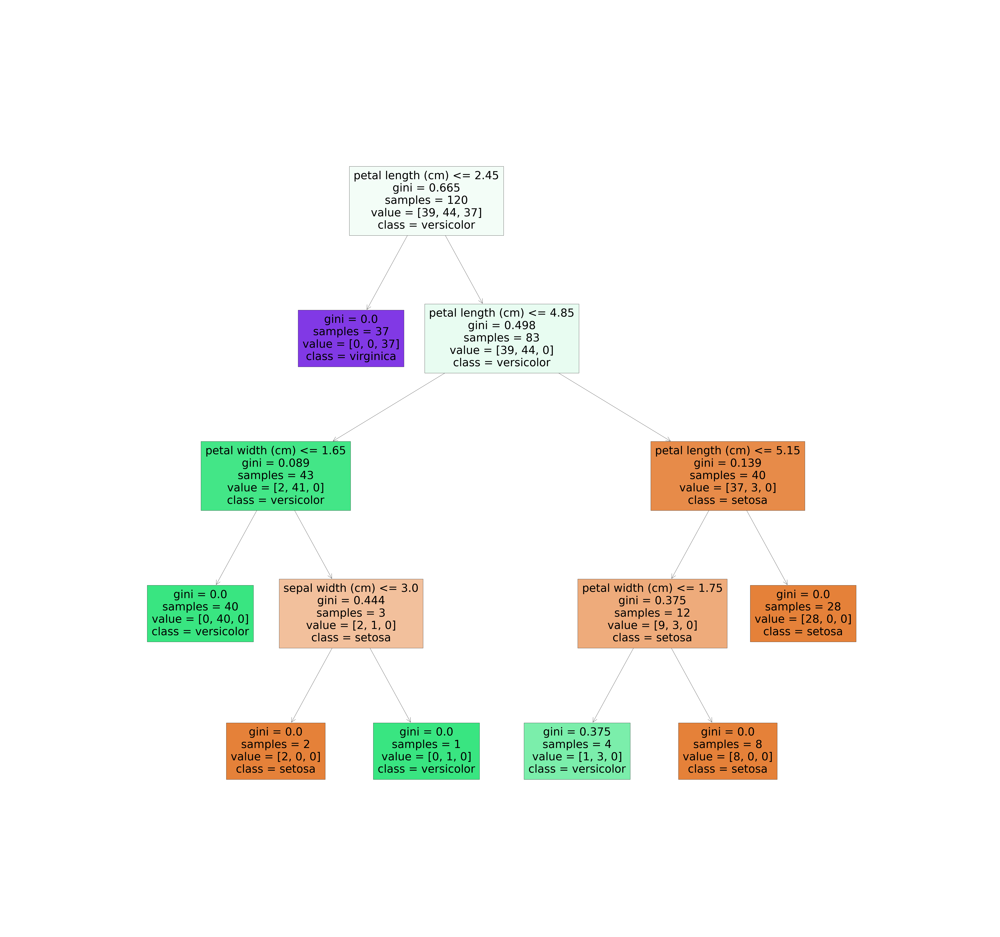

## Name: Ashwini More
## Data Science Intern @LGM
### Level: Intermediate

### Task: Prediction Using Decision Tree Algorithm

#### `Task Description: Create the Decision Tree classifier and visualize it graphically.The purpose is if we feed any new data to this classifier, it would be able to  predict the right class accordingly.` 

### Graphical visualization of Decision Tree

- Youtube Link : 
- LinkedIN Post Link :

